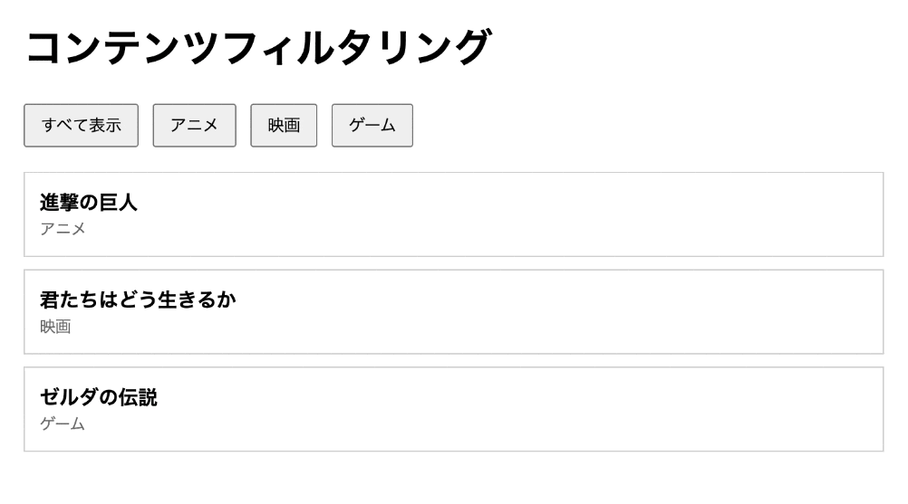

# jsQuiz-neo-04

「カスタムデータ属性を使った表示の絞り込み（フィルタリング）」の振り返りです。

## 課題内容

ジャンルボタンを押したとき、そのジャンルのコンテンツ（`.item`）だけを表示し、それ以外を非表示にします。「すべて表示」ボタンですべての `.item` を表示に戻します。

**フィルタリングの関数と変数は `index.html` にすでに用意してあります。**
あなたの課題は、**各ボタンに `click` イベントを設定して、用意済みの関数を呼び出す**ことだけです。



### HTML の構造（ひな形）

- フィルターボタン群 `.filter-buttons` の中に4つの `<button class="filter-btn">`
  - 「すべて表示」… `.filter-btn.filter-all-btn`（`data-genre` なし）
  - 「アニメ」… `<button class="filter-btn" data-genre="anime">`
  - 「映画」… `<button class="filter-btn" data-genre="movie">`
  - 「ゲーム」… `<button class="filter-btn" data-genre="game">`
- コンテンツ一覧 `.items` の中に複数の `<div class="item" data-genre="...">`（初期状態はすべて表示）
- CSS には `.item.hidden { display: none; }` が用意済み（`hidden` クラスを付けると消える）

### 用意済みの変数・関数（書き換えないこと）

`index.html` の `<script>` 前半に、以下がすでに定義されています。

```js
const items = document.querySelectorAll('.item');     // すべてのコンテンツ
const buttons = document.querySelectorAll('.filter-btn'); // すべてのボタン

filterItems(genre)  // 引数 genre と一致する .item だけ表示、それ以外は非表示
showAllItems()      // すべての .item を表示
```

これらは完成済みです。**自分で作り直す必要はありません**（中身を変更しないでください）。

### あなたの課題

`.filter-buttons` 内の各ボタン（`.filter-btn` ＝ 変数 `buttons`）に `click` イベントを設定し、ボタンに応じて用意済みの関数を呼び出してください。

| ボタン | 呼ぶ関数 |
|---|---|
| アニメ（`data-genre="anime"`） | `filterItems('anime')` |
| 映画（`data-genre="movie"`）   | `filterItems('movie')` |
| ゲーム（`data-genre="game"`）  | `filterItems('game')` |
| すべて表示（`.filter-all-btn`） | `showAllItems()` |

**別のジャンルに切り替えたとき、前のジャンルの `.item` が残らないこと**（`filterItems` が毎回すべての `.item` を判定し直すので、正しく呼び出せば自動的にそうなります）。

---

## 制作手順（ヒント）

用意済みの関数より**後ろ**に、次の処理を書きます。

1. `buttons.forEach(function (btn) { ... })` で各ボタンを順番に処理する
2. ループの中で `btn.addEventListener('click', function () { ... })` を設定する
3. クリック時の処理:
   - `const genre = btn.getAttribute('data-genre');`
   - `genre` があれば `filterItems(genre)` を呼ぶ
   - `genre` がなければ（＝「すべて表示」ボタン）`showAllItems()` を呼ぶ

`items` / `buttons` / `filterItems` / `showAllItems` はすでに使える状態なので、新しく宣言し直さないでください。

---

## 提出方法

### ① Fork
このリポジトリを自分のアカウントに Fork してください。

### ② clone
自分の Fork を GitHub Desktop で clone します。

### ③ branch を作る
ブランチ名に「quiz4/自分の名前」を記入する（例：quiz4/kawaguchi）

### ④ コードを書く
`students/{自分の番号}/index.html` を編集して課題を完成させます。
（例：出席番号が 7 番なら `students/7/index.html`）

ルートの `index.html` を `students/{自分の番号}/index.html` にコピーしてから編集するのが簡単です。

### ⑤ commit / push
変更を commit して push してください。
- title：出席番号_名前（例：28_河口）
- message：提出します。

### ⑥ Pull Request を作成
元のリポジトリに向けて Pull Request を作成してください。

## 判定について

- Pull Request を出すと自動判定が実行されます
- 成功 → ✅ **合格！** のコメントが付きます
- 失敗 → ❌ **不合格** のコメントと確認ポイントが付きます

結果は PR のコメント欄と「Checks」タブで確認してください。

## ディレクトリ構成

```
jsQuiz-neo-04/
├── index.html              # 問題ファイル（参照・複製元）
├── students/               # 解答フォルダ ★ここに作業する
│   └── {自分の番号}/
│       └── index.html      # index.html を複製して解答を記述
├── .github/                # 自動判定の設定（触らない）
├── tests/                  # 自動判定の設定（触らない）
├── playwright.config.js    # 自動判定の設定（触らない）
└── README.md
```

## 注意

- `students/{自分の番号}/index.html` の `<script>` 内、**「ここから下があなたの課題です」より後ろ**だけ編集してください
- 用意済みの変数・関数（`items` / `buttons` / `filterItems` / `showAllItems`）は書き換えないでください
- HTML構造（`.filter-buttons` / `.filter-btn` / `.filter-all-btn` / `.items` / `.item` / `data-genre`）は変えないでください
- `.item` の `data-genre` の値（`anime` / `movie` / `game`）は変更しないでください
- `students/` 以外のファイルは変更しないでください
- エラーが出たら修正して再度 push してください

---

## 模範解答

授業資料の[JSQuiz_neo模範解答](https://2026doc.hideok.org/first-term/javascript/post-quizanswer)
